## Outil de détection et de reconnaissance faciale

### Description du projet

Nous sommes inondés d&#39;images. Les smartphones sont équipés d&#39;appareils photo, et prendre une photo ou une vidéo et la partager n&#39;a jamais été aussi simple, ce qui a entraîné la croissance incroyable des réseaux sociaux modernes comme Instagram YouTube est peut-être le deuxième moteur de recherche en importance et des centaines d&#39;heures de vidéo sont téléchargées chaque minute et des milliards de vidéos sont visionnées chaque jour. 
Internet est composé de textes et d&#39;images. Il est relativement simple d&#39;indexer et de rechercher du texte, mais pour indexer et rechercher des images, les algorithmes doivent savoir ce que les images contiennent. Pendant très longtemps, le contenu des images et des vidéos est resté opaque, mieux décrit à l&#39;aide des méta-descriptions fournies par la personne qui les a téléchargées. 
Pour tirer le meilleur parti des données d&#39;image, nous avons besoin d&#39;ordinateurs pour « voir » une image et en comprendre le contenu. C&#39;est un problème trivial pour un humain, même de jeunes enfants. En effet
- Une personne peut décrire le contenu d&#39;une photographie qu&#39;elle a vu une fois.
- Une personne peut résumer une vidéo qu&#39;elle n&#39;a vue qu&#39;une seule fois.
- Une personne peut reconnaître un visage qu&#39;elle n&#39;a vu qu&#39;une seule fois auparavant.

Nous avons besoin d&#39;au moins les mêmes capacités des ordinateurs afin de déverrouiller nos images et vidéos.
C’est dans ce cadre que s’inscrit ce projet qui consiste à mettre en place un outil de détection et de classification d’images qui permet de détecter le visage d’une personne dans une image de même que de reconnaître une personne afin de pouvoir à travers d’autres images.

### Présentation de l'application

#### Accueil
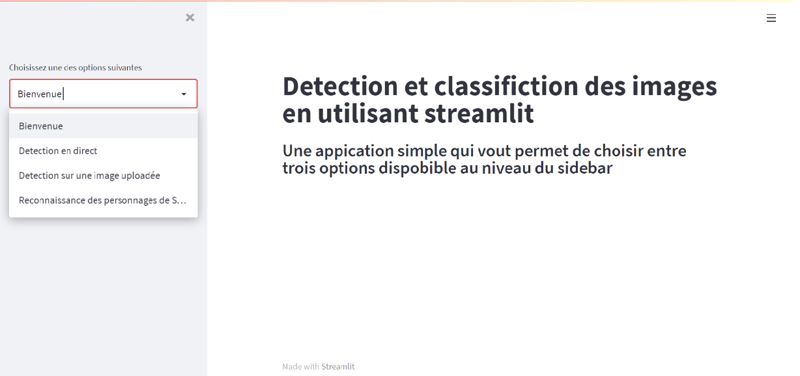

#### Détection avec HaarCascade
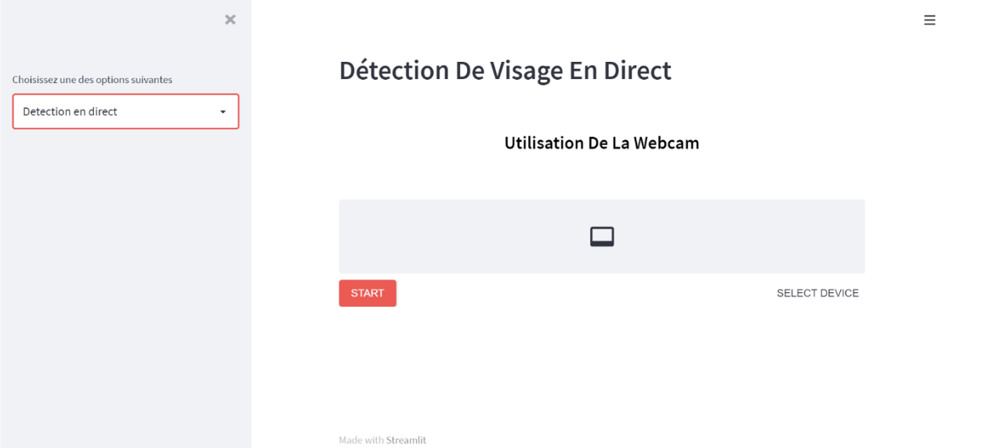
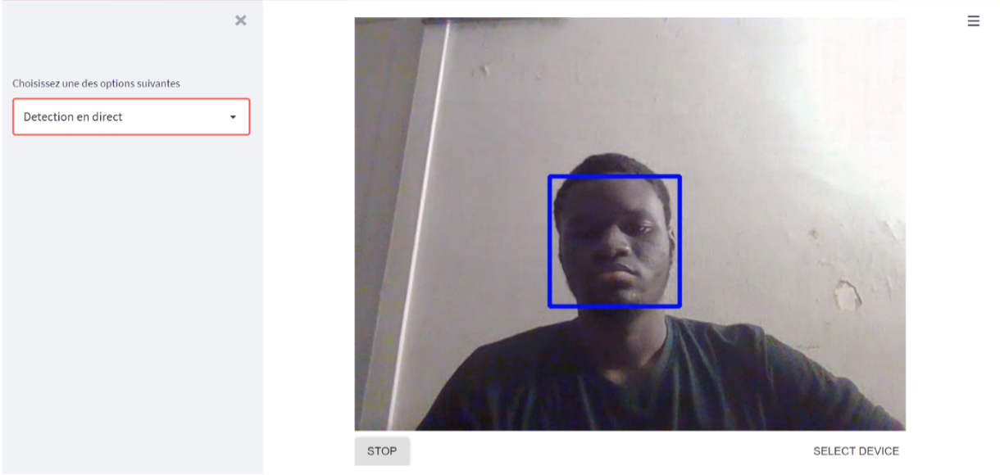
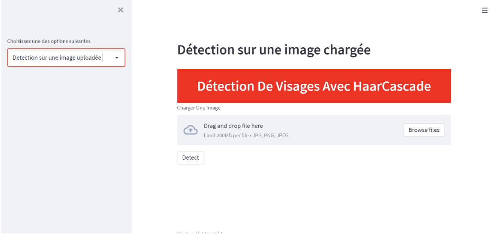
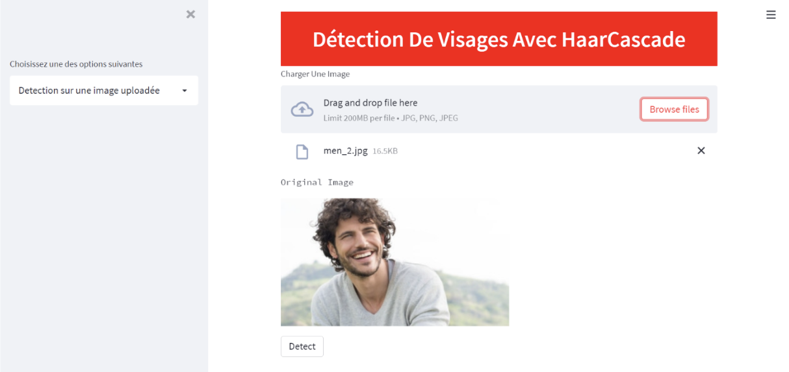
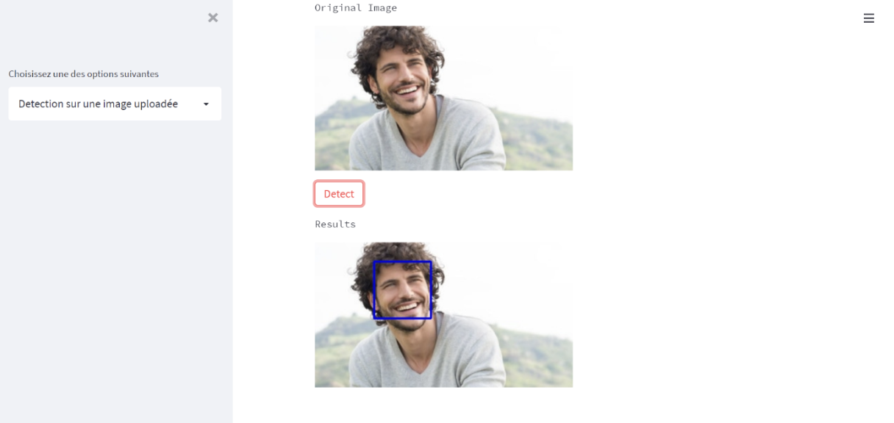

Pour effectuer la détection du visage, nous avons utilisé les HaarCascadeClassifiers en prenant soin de d'abord d'effectuer les prétraitements nécessaires sur l'image.
Comme nous le montre les images ci-dessus, l’utilisateur peut soit effectuer une détection en direct auquel cas la caméra de son appareil est utilisé comme source et la détection est effectué frame par frame avec le ou les visages détectés délimité par le carré bleu. Il peut aussi effectué une détection sur une image de son choix en passant le fichier au travers du widget d'upload.

#### Reconnaissance faciale sur les personnages des Simpsons
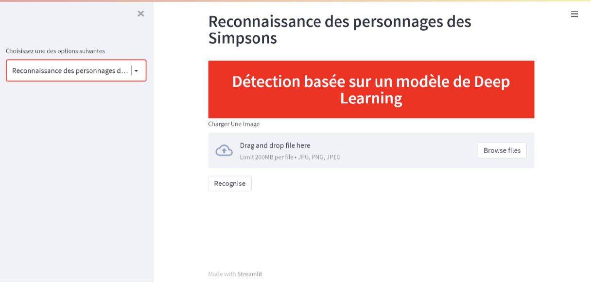
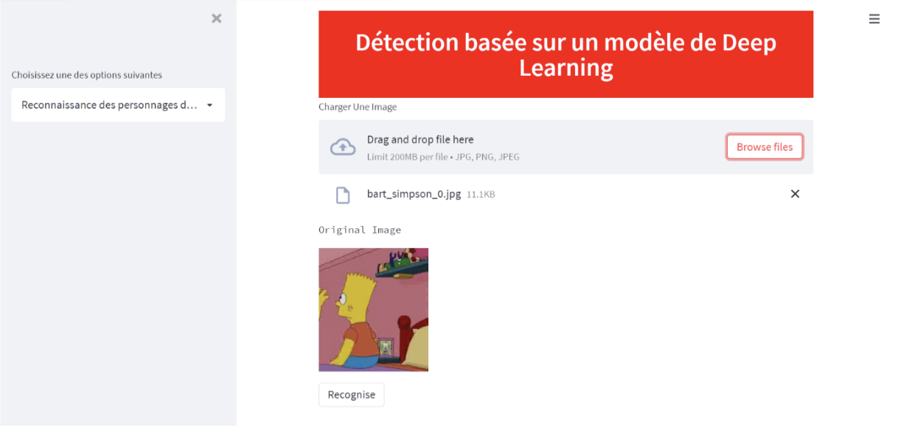
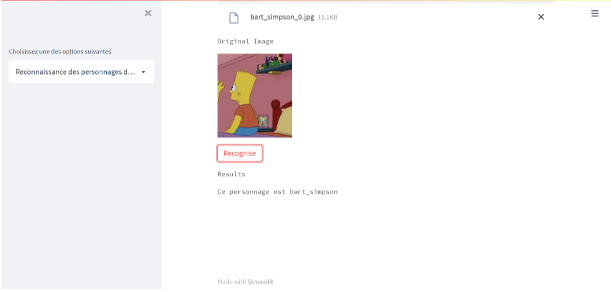

Pour effectuer cette reconnaissance, nous avons utilisé Tensorflow pour créer un modèle basé sur les réseaux de neurones convolutifs (CNN). Keras-tuner a été utilisé pour tenter d'optimiser les hyperparamètres et trouver le meilleur modèle possible.
Les résultats obtenu après celà sont les suivants

<table>
<tr>
<th>Classification Report</th>
<th>Confusion Matrix</th>
</tr>
<tr>
<td>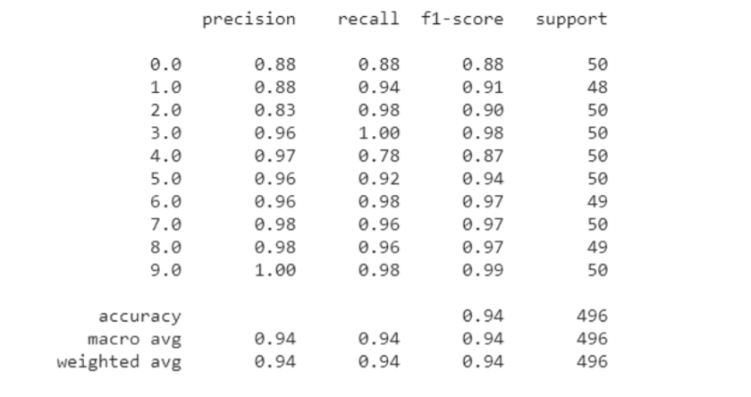</img></td>
<td>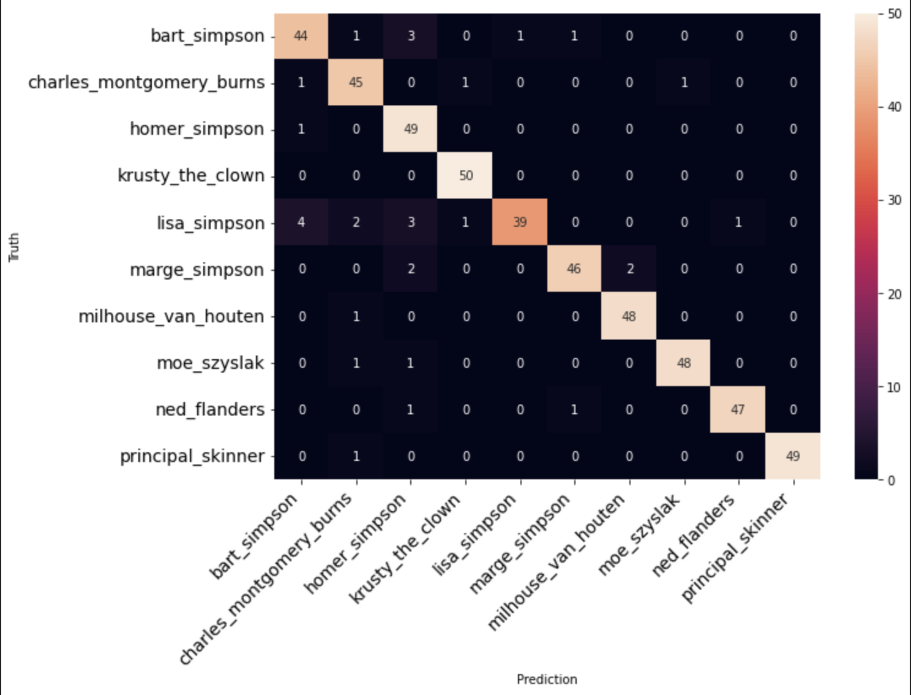</img></td>
</tr>
</table>

Vous pouvez trouver le code source dans le dossier **Notebooks**.
- Le fichier *model.ipynb* contient le code relatif à la création du modèle de reconnaissance faciale
- Le fichier *main.ipynb* contient le code relatif au déploiement sur Streamlit

Vous pouvez accèder à l'application en suivant le lien. 
  [Cliquez-ici!](https://share.streamlit.io/kingsene19/streamlit_app/main/main.py)
